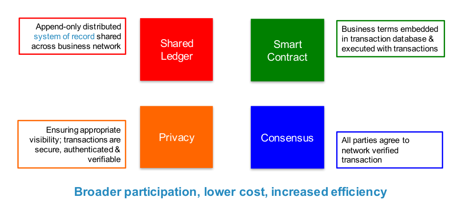
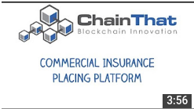

##Shared ledger

## Consensus

##Smart Contract
")

## Anonymity and Privacy in a untrusted network
* **Pseudonymity**: Public keys must not reveal real identities. Transactions must not reveal real identities.
* **Unlinkability**: It is not possible to link different pseudonyms of a real identities.

				Anonymity = Pseudonymity and Unlinkability.

**Privacy** is provided by encrypting the application data.

## Provenence in Supply Chain Management
 

##Internet of Value
 

