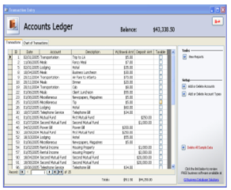

#Blockchain: A Distributed ledger
##Assets
Anything that is capable of being owned or controlled to produce value, is an asset.
  

* **Tangible Assets:** Asset that has a physical form.  e.g. Machinery, Buildings and Land.

* **Intangible Assets:** Asset that is not physical in nature.
    * Intangible assets are subdivide as
        * Financial, e.g. bond
        * Intellectual e.g. patents
        * Digital e.g. music

##Ledger
* **Ledger** is a principal book (or computer file) for recording asset transfer between participants.

     

* **Distributed** ledger(shared ledger) is a ledger that is replicated, synchronized and spread across multiple sites, countries, and/or institutions.

##What is Blockchain
Blockchain is an append-only distributed ledger, where records are stored in blocks, and blocks form a chain.

Every block contains transactions, that can be verified by any node in the network.
Consensus is procedure to have an accurate Blockchain at every node.

