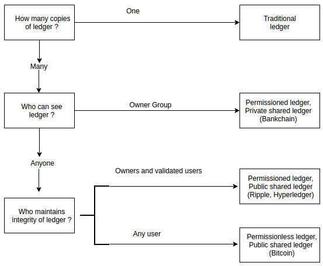
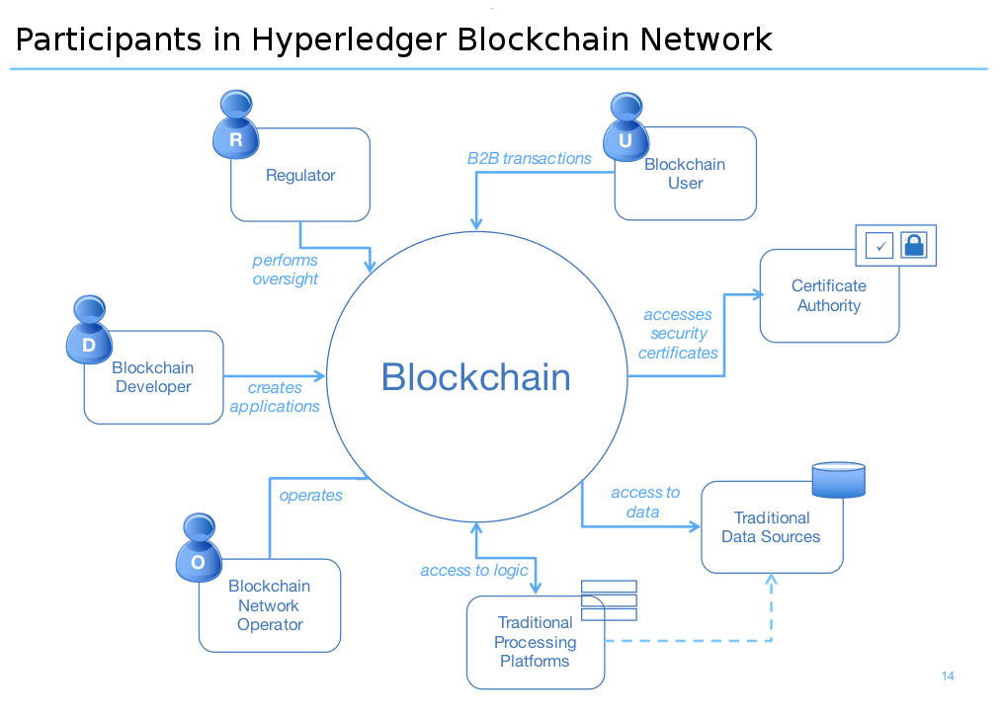
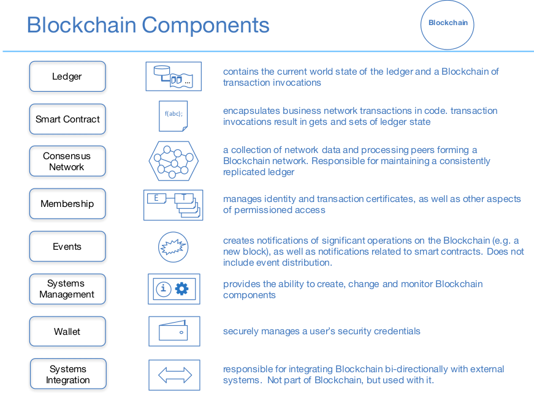

##Public ledger 
Decentralized, anyone can read and send tranasctions, e.g. Bitcoin, Ethereum, Hyperledger
##Private ledger
Centralized under one organization which controls the right to view ans send transactions, e.g. Bankchain

##What is consensus:

##Consensus defines types of Blockchain
* **Permissionless Blockchain**: Every node in the network participate in consensus procedure, e.g. Bitcoin Blockchain (Proof of Work)
* **Permissioned Blockchain**: Only Selected nodes(validators, e.g. Government or trusted nodes) participate in consensus procedure e.g. Hyperledger Blockchain

###Bitcoin (Public-Permissionless Blockchain) 
")
")

###Hyperledger (Public-Permissioned Blockchain)

**Hyperledger** The Hyperledger Project (www.hyperledger.org) is a collaborative effort to create an enterprise-grade, open-source distributed ledger framework and code base. It aims to advance blockchain technology by identifying and realizing a cross-industry open standard platform for distributed ledgers, which can transform the way business transactions are conducted globally. It is  a protocol for business­-to-­business and  business­-to-­customer transactions.

**Hyperledger Fabric** Hyperledger Fabric (github.com/hyperledger/fabric) is an implementation of a distributed ledger platform for running smart contracts, leveraging familiar and proven technologies, with a modular architecture allowing pluggable implementations of various functions. It is one of multiple projects currently in incubation under the Hyperledger Project. A developerpreview of the Hyperledger Fabric (called “v0.5-developer-preview”) has been released in June 2016 (github.com/hyperledger/fabric/wiki/Fabric-Releases)

**Why a new fabric:** Scalability challenges, and the lack of support for confidential and private transactions, among other limitations, make its use unworkable for many business­critical applications. To meet the varied demands of the modern marketplace, Hyperledger has been designed for a broad array of industry­focused use cases, thereby extending the work of the pioneers in the field by addressing the existing shortcomings.
The fabric implements a permissioned ledger, it contains a security infrastructure for authentication and authorization. It supports enrollment and transaction authorization through public-key certificates, and confidentiality for chaincode realized through in-band encryption. More precisely, for connecting to the network every peer needs to obtain an enrollment certificate from an enrollment CA that is part of the membership services. It authorizes a peer to connect to the network and to acquire transaction certificates, which are needed to submit transactions. Transaction certificates are issued by a transaction CA and support pseudonymous authorization for the peers submitting transactions, in the sense that multiple transaction certificates issued to the same peer (that is, to the same enrollment certificate) cannot be linked with each other.

Depending on the purpose of the network, the issuing authority assigns the appropriate level of access that is required to obtain an identity and transact on the network. A network can be run very publicly, making it easy to integrate into a mobile app project, or it can be completely private and known only to invited participants whose identities have been validated. 

* A validating peer is a node on the network responsible for running consensus, validating transactions, and maintaining the ledger. 
* A non-validating peer is a node that functions as a proxy to connect clients (issuing transactions) to validating peers. A non-validating peer does not execute transactions but it may verify them.

*Some key features of the current fabric release are:*

* A permissioned blockchain with immediate finality;
* Runs arbitrary smart contracts (called chaincode) implemented in Go (golang.org):
	* User-defined chaincode is encapsulated in a Docker container;
	* System chaincode runs in the same process as the peer;
* Consensus protocol is pluggable, currently an implementation of Byzantine fault-tolerant consensus using the PBFT protocol is supported, a prototype of SIEVE to address nondeterministic chaincode is available, and a protocol stub (named NOOPS) serves for development
on a single node;
* Security support through certificate authorities (CAs) for TLS certificates, enrollment certificates, and transaction certificates;
* Persistent state using a key-value store interface, backed by RocksDB (rocksdb.org);
* An event framework that supports pre-defined and custom events;
* A client SDK (Node.js) to interface with the fabric;
* Support for basic REST APIs and CLIs

Importance of both privacy and confidentiality: 
One of the fundamental requirements for any blockchain fabric is that the $identity$ and $patterns of behavior$ of any party on a network must be impossible for unauthorized parties to ascertain by inspecting the ledger. To allow blockchain users to make certain business logics and/or other parameters of a transaction confidential, rendering them inaccessible to anyone other than the stakeholders for the contract or the asset being transferred, the Hyperledger protocol starts with a cryptographic certificate encapsulating a user’s confidential data, which is registered on a Registration Authority. The Registration Authority can issue and revoke identities that are participating in a network. From each identity, the protocol can generate security keys for members to transact on a network, which conceal the identities of the transacting parties, providing privacy support to the network.

Content confidentiality is achieved by encrypting the transactions such that only the stakeholders can decrypt and execute them. In addition, a piece of business logic (realized by a smart contract) can also be cryptographically secured (if confidentiality is required by its stakeholders) so that it only gets loaded and decrypted at runtime.