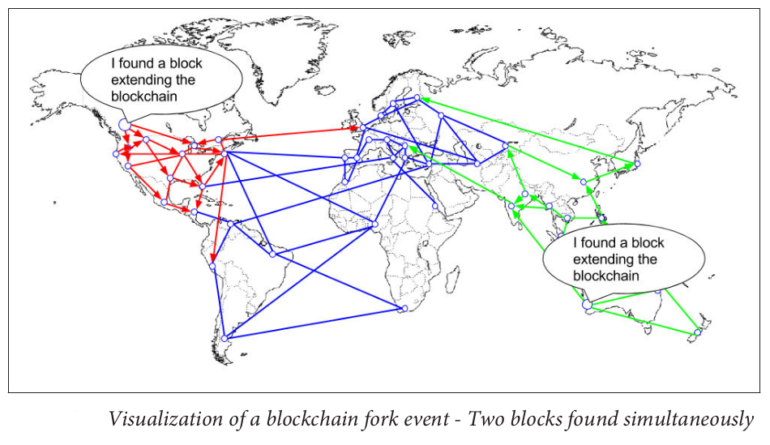
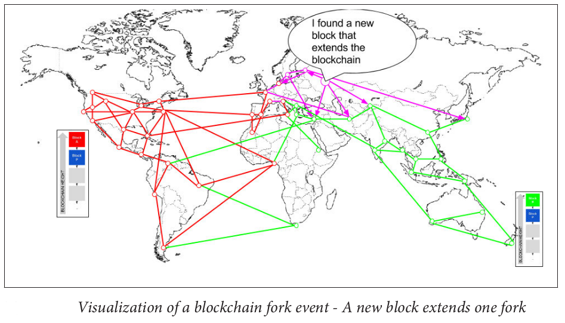
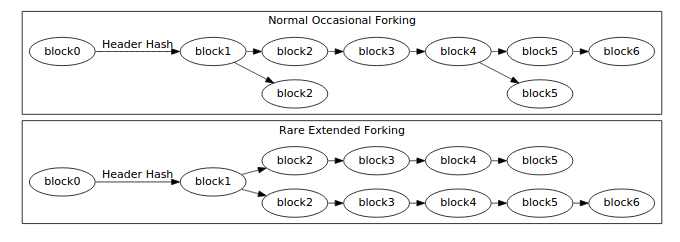

## Consensus achieved using Proof-of-Work.
* New transactions are broadcast to all nodes.
* Each node collects new transactions into a block.
* Each node works on finding a difficult proof-of-work for its block.
* When a node finds a proof-of-work, it broadcasts the block to all nodes.
* Nodes accept the block only if all transactions in it are valid and not already spent.
* Nodes express their acceptance of the block by working on creating the next block in the chain, using the hash of the accepted block as the previous hash.
* Nodes always consider the longest chain to be the correct one and will keep working on extending it.

Cryptocurrencies such as Bitcoin enable users to submit payment transactions without going through a centralized trusted organization. Bitcoin relies on proof-of-work mining to secure consensus which is problematic because mining requires a massive expenditure of energy, confirmation of transactions is slow, and security is difficult to quantify. 
There are proposals to develop new consensus algorithms, such as Proof of Stake consensus and Byzantine fault tolerance consensus.

## Consensus without Mining - Proof of Stake
In the Proof of Stake model used by, network security is governed by peers having a stake in the network. The incentives provided by this algorithm do not promote centralization in the same way that Proof of Work algorithms do. The network has will be highly decentralized because a large number of unique accounts are contributing blocks to the network by voting, and block creation reward is shared among the participant in proportion to their stake. 

In a *nothing at stake attack*, forgers attempt to build blocks on top of every fork they see because doing so costs them almost nothing, and because ignoring any fork may mean losing out on the block rewards that would be earned if that fork were to become the chain with the largest cumulative difficulty. This makes consensus on a single blockchain not guaranteed.

## Consensus without Mining - Practical Byzantine fault tolerance (PBFT)
Byzantine fault-tolerant algorithms are  important because malicious attacks and software errors are increasingly common and can cause faulty nodes to exhibit arbitrary behavior(Bizantine faults).  PBFT works in asynchronous environments like the Internet and after PBFT, several BFT protocols were introduced to improve its robustness and performance. Hyperledger consensus and TendermintCore consensus are example of such consensus algorithms.

### Tendermint Consensus
Tendermint is a solution to the blockchain consensus problem that does not require mining by adapting an existing solution to the Byzantine Generals Problem. It solves the the nothing at stake problem of Proof of Stake problem.
The algorithm is based on a modified version of the DLS protocol, and is resilient up to $1/3$ of Byzantine participants.
TendermintCore is a high-performance blockchain consensus engine that enables you to run Byzantine fault tolerant applications, written in any programming language, on many machines spread across the globe, with strong security guarantees.

### Hyperledger Consensus

