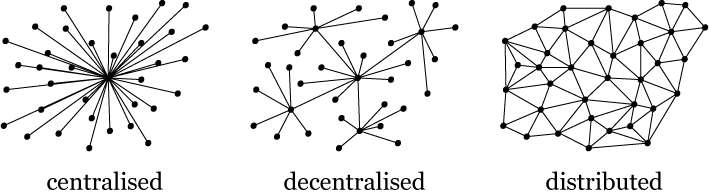

This is a documentation of Blockchain Technology, for **simple explanation**.  It is created by taking notes from various websites for educational purpose.

**Why study blockchain:** Because it is an append-only distributed ledger, which is widely adopted.

